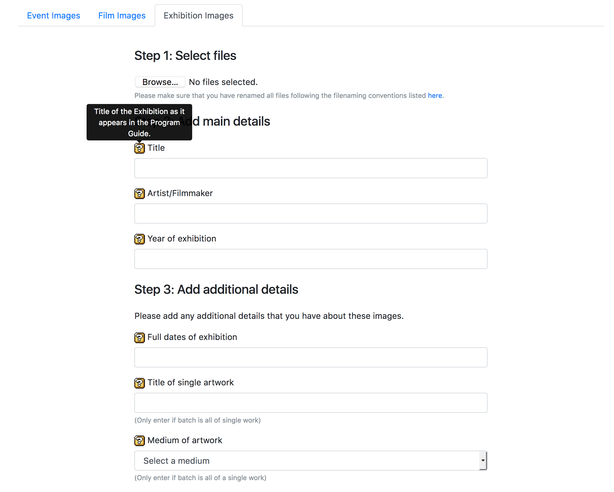
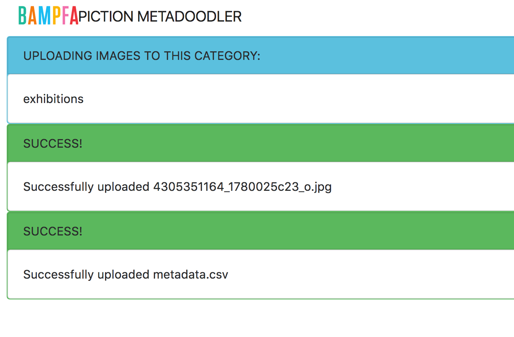

# piction-metadoodler

This is a web form to enter metadata and FTP image files to Piction.

Currently there are three categories that are set up: *Event Images*, *Film Stills*, and *Exhibition Images*. 

Users enter metadata for a batch of images (i.e., this is for bulk metadata), which generates a csv that Piction can use to apply the metadata on ingest. I am working on getting tooltips so that staff can reference our [metadata dictionary](https://bam-pfa.github.io/BAMPFA-documentation/piction/piction-metadata-guide/). We have the FTP directory set up to ingest every couple of hours.

There are some basic security measures in place, we're looking at more.... 

Uses Bootstrap for styling.

The uploading/data entry screen looks like this: 

The result screen looks like this:

